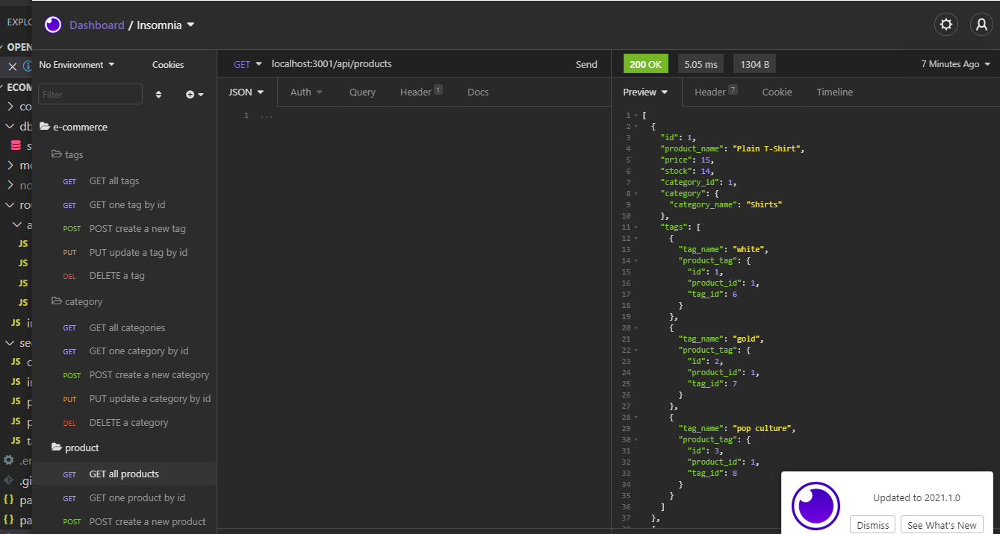
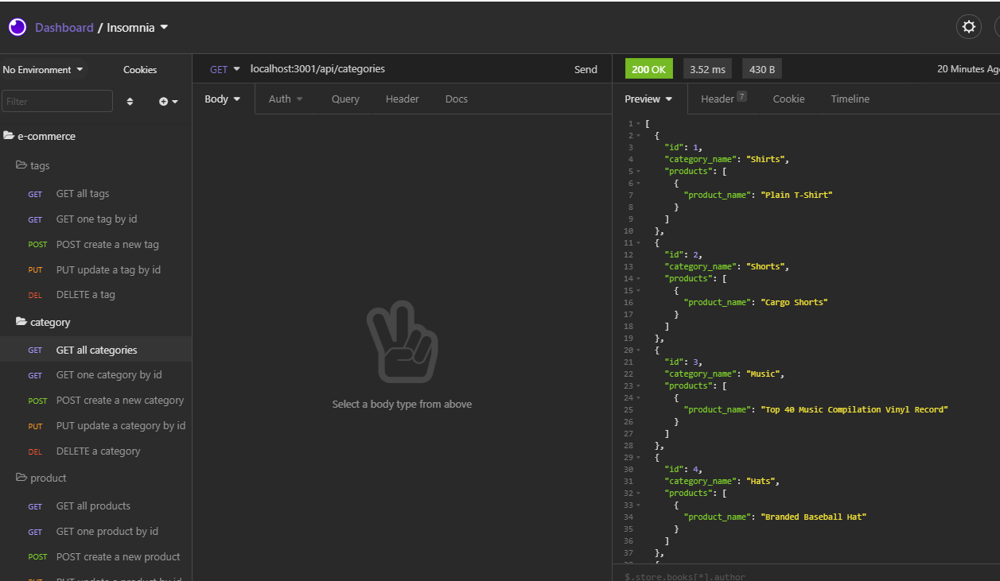
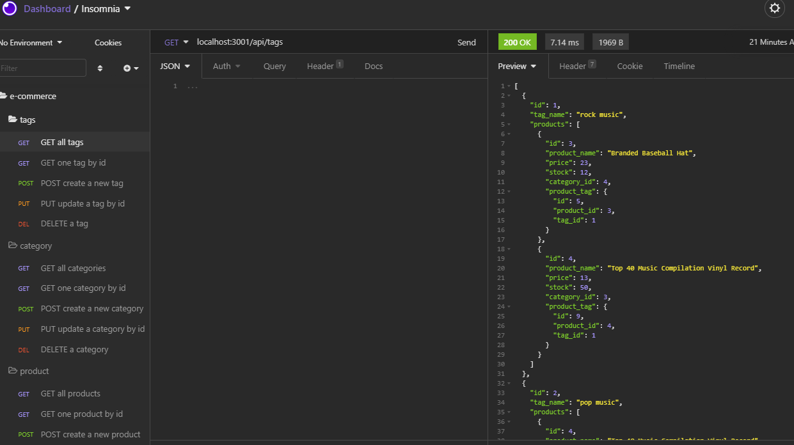
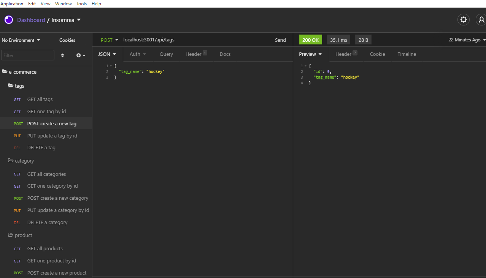
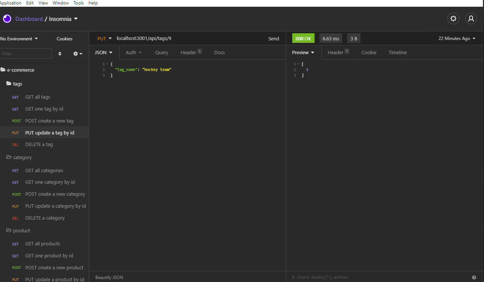

# Ecommerce Backend
Application that updates categories, products, and tags of a company

## Table of Contents
* Overview
* Technologies
* Status
* Screenshot

## Overview
TThe goal of the assignment is to create an app that updates categories, products, and tags for a ecommerce company. The below link will guide the user how to use the application. I have included a screenshot of the appication's test code and the end result.

## Technologies
Project created with:
* Node
* JS
* Insomnia
* Sequelize
* MySQL

## Status
To view a user guide of my project please visit the below.

[Ecommerce Guide](https://drive.google.com/file/d/1TteP692cUPp5KRuoQLvsWysRk-WEJ3l-/view)

## Screenshot

)
)
)
)
)
